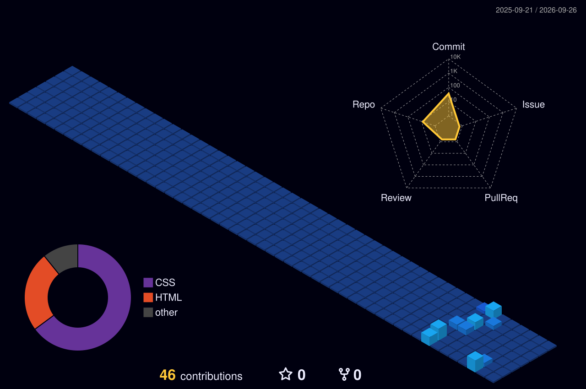
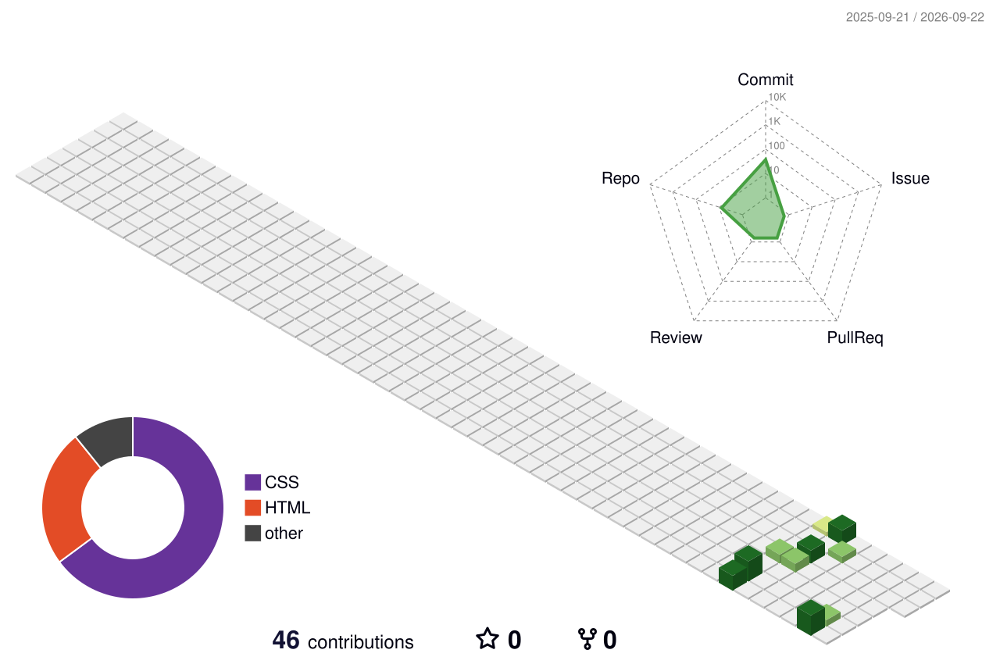

<div align="center">


<br/><br/>

[](https://mark-one1.github.io/naiduportfolio/)
[](https://github.com/Mark-one1)
[](https://github.com/Mark-one1?tab=repositories)

</div>

<br/>

---

<br/>

## 👨‍💻 `whoami`

```yaml
name: NAIDU
located_in: India
role: Full-Stack Developer
current_focus: 3D Web Experiences with Three.js
skills:
  frontend: [HTML5, CSS3, JavaScript, React]
  backend: [Node.js, REST APIs]
  creative: [Three.js, WebGL, GSAP, UI/UX]
  database: [MongoDB, MySQL]
  tools: [Git, GitHub, VS Code, Figma]
fun_fact: "I make websites feel alive with 3D magic ✨"
motto: "Code is poetry — make it beautiful."
```

<br/>

## 🚀 Tech Arsenal

<div align="center">

### Frontend


### 3D & Creative


### Backend & Tools


</div>

<br/>

---

<br/>

## 📊 GitHub Analytics

<div align="center">


<br/><br/>

[](https://github.com/Mark-one1)

</div>

<br/>

## 🧊 My Contribution Calendar in 3D

<div align="center">

### 🌃 Night View


<br/><br/>

### 🟢 Animated 3D City


</div>

<br/>

---

<br/>

## 🏆 Achievements & Activity

<div align="center">


<br/><br/>


</div>

<br/>

---

<br/>

## 🐍 Watch My Code Slither


<br/>

---

<br/>

## 🎯 Featured Work

<div align="center">

| Project | Description | Tech |
|:---:|:---|:---:|
| [**3D Portfolio**](https://github.com/Mark-one1/naiduportfolio) | Immersive portfolio with Three.js starfield, neon wireframes & mouse parallax |  |
| [**Live Demo**](https://mark-one1.github.io/naiduportfolio/) | Experience the 3D web magic in your browser — no installs needed |  |

</div>

<br/>

## 🤝 Let's Connect

<div align="center">

[](https://github.com/Mark-one1)

</div>

<br/>

<div align="center">

### 💭 *"First, solve the problem. Then, write the code."* — John Johnson

<br/>

**Visitor Count**


</div>

<br/>


